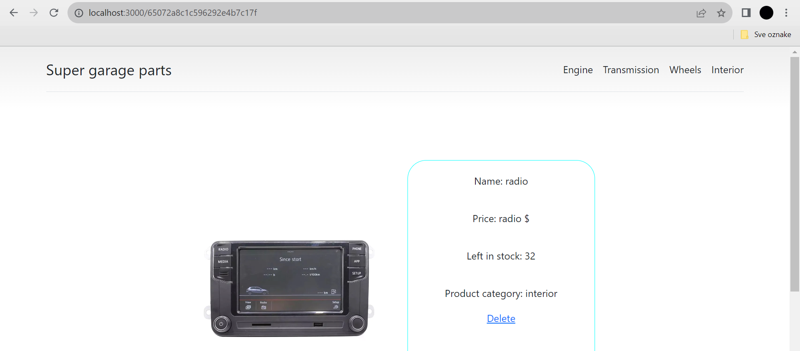

# Inventory app (Node.js + Express.js)

Example project written in Express.js, using MongoDB as database.

## Description

Posts are right now visible to everyone who visits page, and everyone can create or delete them. It shows CRUD operations with MongoDB. 


## Short Walkthrough

1. All products are displayed on homepage, but links lead to each category where are displayed only products for each that category.


2. Each product can be viewed separately, on detailed page it is possible to delete each product. 


3. When product is deleted 'unlnk' function from 'fs' is used to remove old file from public directory.




```js
unlink(`public/${part.file}`, (err) => {
                console.log(err);
            })

```

4. When we create product, file that we upload is set in public directory and filename is saved in database. I used 'multer' library for that.


```js
const storage = multer.diskStorage({
    destination: (req,file, cb) => {
        cb(null, 'public')
    },
    filename: (req, file, cb) => {
        const name = Date.now() + path.extname(file.originalname);
        CUR_FILE_NAME = name;
        cb(null, name);
    }
})

const upload = multer({storage: storage});
```

```js
app.post('/', upload.single('image') ,async (req, res) => {
    let newItem = req.body;
    newItem.file = CUR_FILE_NAME;
    
    try{
        const result = await db.collection('products')
            .insertOne(newItem)
        res.status(200).redirect('/');
    } catch (err) {
        console.log(err);
        res.status(500).redirect('/404');
    }
})
```